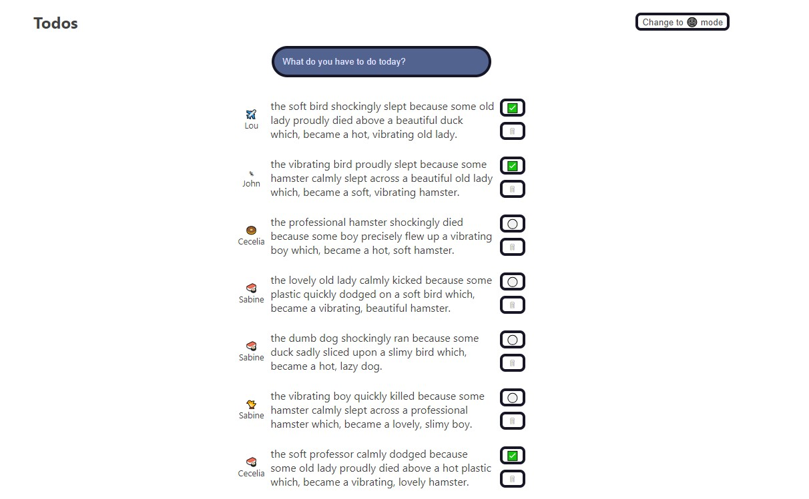

# Theme Toggler

## Table of contents

- [Overview](#overview)
  - [The challenge](#the-challenge)
  - [Screenshot](#screenshot)
  - [Links](#links)
- [My process](#my-process)
  - [Built with](#built-with)
  - [What I learned](#what-i-learned)
  - [Continued development](#continued-development)
- [Author](#author)

## Overview

### The challenge

Users should be able to:

- View the optimal layout for the app depending on their device's screen size
- Change the background between black and white
- Input task to add to list
- Check off task in list
- Delete task from list

### Screenshot

### Links

- Live Site URL: [View](https://themetoggler24.netlify.app/)

## My process

- To implement the light/dark theme feature, we create a custom hook called `useTheme` that manages the theme state using `useState` and updates the application's styling with `useEffect`.
- Inside the hook, we store the current theme ("light" or "dark") in state and use `document.documentElement.setAttribute` to modify the page's `data-theme` attribute, which controls the CSS.
- We also create an `onToggleTheme` function to toggle the theme between light and dark modes.
- A boolean `isDarkTheme` is returned to indicate whether the dark mode is active.
- In the `Header` component, we use the custom hook to toggle the theme and dynamically update the button text based on the current mode.
- The button text changes to either "Change to 🌞 mode" or "Change to 🌚 mode" depending on the theme.

### Built with

- Semantic HTML5 markup
- CSS custom properties
- Mobile-Responsive Design
- JavaScript - Scripting language
- [React](https://reactjs.org/) - JS library

### What I learned

This was a class project to learn about custom hooks.

### Continued development

maybe use later

## Author

- Website - [Cameron Howze](https://camkol.github.io/)
- Frontend Mentor - [@camkol](https://www.frontendmentor.io/profile/camkol)
- GitHub- [@camkol](https://github.com/camkol)
- LinkedIn - [@cameron-howze](https://www.linkedin.com/in/cameron-howze-28a646109/)
- E-Mail - [cameronhowze4@outlook.com](mailto:cameronhowze4@outlook.com)
